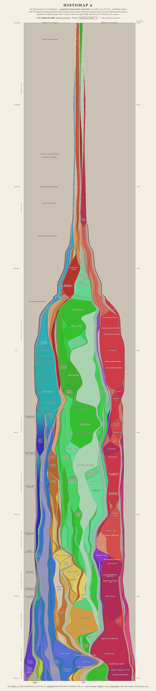
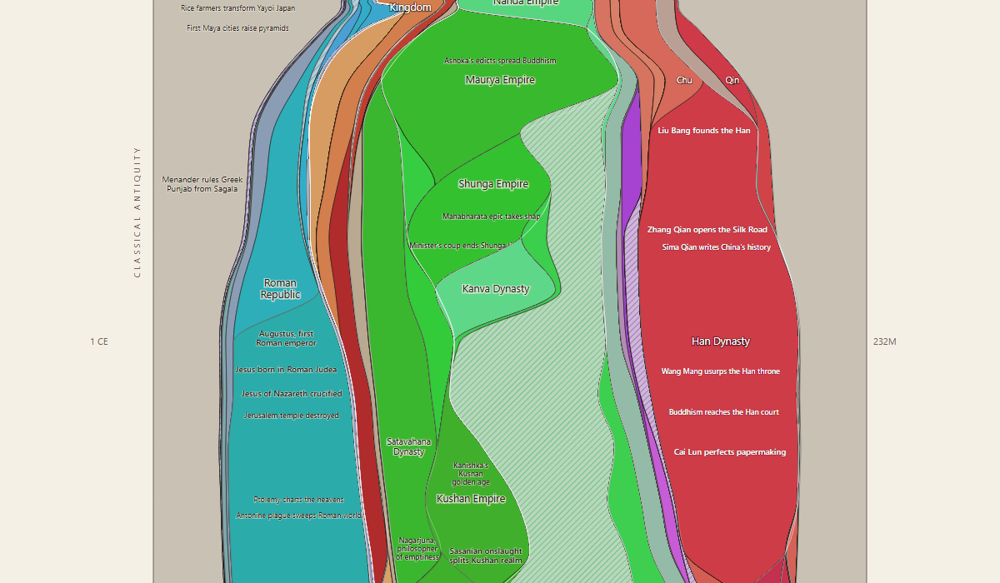
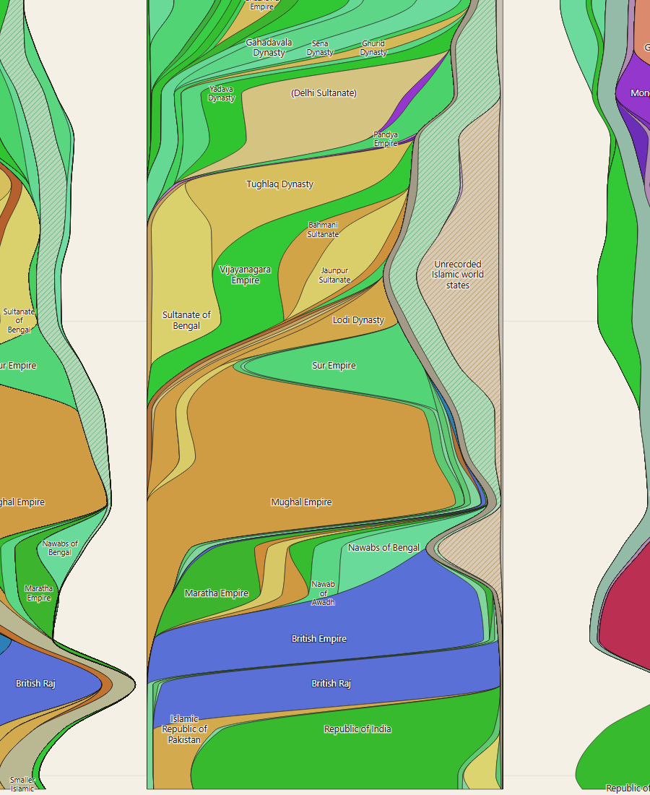

# Demograph

**An interactive remake of John B. Sparks's 1931 _Histomap_ — four thousand
years of world history as a single vertical stream graph, this time with a
metric you can actually defend.**



🔗 **Live demo:** https://alexandrosm.github.io/Demograph/
*(or just open [`web/index.html`](web/index.html) — the app is static, no build step)*

---

Sparks's original sized each civilization's colored stream by an undefined
notion of "relative power," which is the chart's most-criticized flaw. Demograph
replaces it with an explicit, reproducible metric — **share of world population
living under each polity** — computed by intersecting historical border polygons
([Cliopatria](https://github.com/Seshat-Global-History-Databank/cliopatria))
with a gridded population reconstruction
([HYDE 3.2.1](https://doi.org/10.17026/dans-25g-gez3)) for ~68 time slices from
2000 BCE to 2015 CE. Everything else — colors, ordering, annotations — is
derived from that data, not asserted.

## Features

- **Two width modes** — *share of world population* (100 %-stacked) or
  *absolute population* (the chart becomes a trumpet bell as humanity explodes
  after 1700).
- **Color = civilization**, classified from each polity's religion + language
  fingerprint (Wikidata), with shades drifting along linguistic kinship and
  vertical gradients marking divergence (the USA fades out of British blue;
  Byzantium out of Roman azure into Orthodox indigo).
- **Nine palettes** — four faithful (Civilizational, 1931 Print, Night Atlas,
  Pastel) and five experimental (Age of Empires, where hue encodes a polity's
  founding date; Stained Glass; Geologic Strata; Cyanotype; Vaporwave).
- **Click to focus a region** — the world parts aside and that land's column
  shows *who ruled it*, whatever their civilization: India runs Maurya → Gupta →
  Sultanates and Mughals (Islamic amber) → the Raj (Western blue) → the Republic
  (green). Shift-click focuses the *civilization* instead.
- **Event annotations** — ~400 curated, telegraphic, era- and region-balanced
  notes anchored to the ruling stream, placed with exact text measurement and
  hard-clipped to their stream so nothing leaks. Region columns add
  **catastrophe banners** ("BLACK DEATH RAVAGES EUROPE", "OLD WORLD PLAGUES
  EMPTY THE AMERICAS") detected from population collapses the world view can't
  see.
- **Honest about gaps** — population the sources can't place under any state is
  shown as a gray "stateless / unmapped" band rather than hidden, and a
  derived *unrecorded-states* overlay (hatched, colored by civilization) marks
  population that surely lived under *some* unmapped local polity.

| Annotation texture | Region focus (India) |
|---|---|
|  |  |

## Run it

The visualization is a single static page — clone and open
[`web/index.html`](web/index.html) in a browser, or visit the live demo. No
bundler, no server.

To rebuild the data from scratch:

```bash
python -m venv .venv
.venv/bin/pip install -r requirements.txt        # Windows: .venv\Scripts\pip

python pipeline/download_hyde.py                  # population grids (range-fetched)
# + place Cliopatria & Natural Earth in data/raw/ (see NOTICE)
python pipeline/compute_shares.py                 # -> data/processed/population_shares.csv
python pipeline/fetch_fingerprint.py              # Wikidata religion/language
python pipeline/unrecorded_overlay.py             # the unrecorded-states layer
python pipeline/build_region_grid.py              # Natural Earth -> region grid
python pipeline/region_focus.py                   # -> web/regions.js
python pipeline/reoptimize.py                     # stream order -> web/data.js
python pipeline/merge_events.py data/processed/explanations.json \
                                data/processed/region_explanations.json
```

## How it works

**The metric & pipeline.** For each time slice, Cliopatria polygons valid that
year are rasterized onto HYDE's 5-arc-minute grid (smaller polities burn last so
they win overlaps), population is summed per polity, and shares are emitted with
an explicit residual band. Populated cells whose center falls just outside every
polygon (coastlines, deltas, atolls — a rasterization artifact that was 98 % of
the apparent "stateless" population at 2000 CE) snap to the nearest polity.
BCE/intermediate slices interpolate population per-cell between HYDE's anchor
years; polity borders are exact per slice.

**Civilizational color** (`pipeline/fingerprint.py`). A cascade — hand overrides
→ first Wikidata religion claim → language family with era rules
(Persian/Arabic/Turkic ⇒ Islamic sphere only after 622/950 CE; Greek ⇒ Classical
before 330 CE, Orthodox after) → geographic fallback — sorts every polity into
one of eleven families. This is what makes the Mughals render amber *inside*
green India, a Persianate-Islamic ruling layer over a Hindu population.

**Stream ordering** (`pipeline/wiggle.py`). Stacking order and color are
decoupled: shades follow civilizational kinship, while the displayed order is
optimized to minimize "wiggle" (a stream's width change displacing everything
stacked after it). A *succession-fidelity* constraint, seeded from a
spatial transfer matrix (`pipeline/transfer_matrix.py`, e.g. Qing→PRC 482M),
forbids placing two streams adjacently as a false handoff unless real population
actually transferred between them.

**The unrecorded-states overlay** (`pipeline/unrecorded_overlay.py`). A
civilizational look-back rule: a populated, unmapped cell is attributed to the
family of its most recent ruler if that rule was within 500 years — so
post-Gupta India and sub-Roman Britain read as "unrecorded local states"
(hatched) rather than statelessness, while genuinely never-governed land (pre-
Columbian Amazonia) stays gray.

**Events & inflection detection** (`pipeline/sharp_changes.py`,
`region_sharp_changes.py`). The chart's own dynamics drive the annotations:
sharp share changes are detected, transfer-matrix partners moving oppositely are
recognized as successions, and the unexplained inflections were handed to a
research pass that wrote the explaining events. Region-total population collapses
(invisible to share-based detection because everyone shrinks together) become
the catastrophe banners.

**Geographic focus & regions** (`pipeline/region_focus.py`,
`build_region_grid.py`). Region boundaries are deliberate — Natural Earth country
polygons assigned through an auditable country→region table
(`data/processed/region_grid_audit.csv`), with explicit departures from the UN
scheme (Iran/Afghanistan → Middle East, Mongolia → steppe, Russia split at the
Urals). A ruler appearing in a region through only a fraction of its realm is
annotated, e.g. "United States of America (in East Asia)" — the 1945–52
occupation of Japan.

## Data & licensing

Source **code** is MIT. **Derived data** and the curated **event annotations**
are CC BY 4.0, because the data is computed from CC BY upstream sources
(Cliopatria, HYDE) plus public-domain / CC0 sources (Natural Earth, Wikidata).
Full attribution in [`NOTICE`](NOTICE) and [`LICENSE`](LICENSE). The 1931
original is homage, not reproduced here.

## Limitations & data-quality notes

Modern-era shares (1800–2000) match censuses closely (Qing ≈ 300 M at 1800; 2000
CE figures match). Known issues, mostly inherited from the sources:

- **India is under-mapped throughout antiquity** — Cliopatria maps only
  major-dynasty cores while HYDE fills the whole subcontinent, so the residual
  (and the unrecorded-states overlay) is largest there. HYDE's medieval-India
  population also runs well above McEvedy/Maddison-school estimates.
- **Rome runs ~1.5× low** (HYDE allocates the Mediterranean conservatively).
- **Cliopatria naming quirks** — "Mamluk Dynasty" is the Delhi Sultanate's;
  Egypt's is "Mamluk Sultanate." Alexander's unified empire polygon is dated
  posthumously (323–319 BCE).
- Event placement drops annotations that can't fit a stream cleanly rather than
  letting text overlap; the densest stretches show fewer than were curated.

See the `pipeline/consistency.py` and `decompose_residual.py` diagnostics for
the full investigation.
